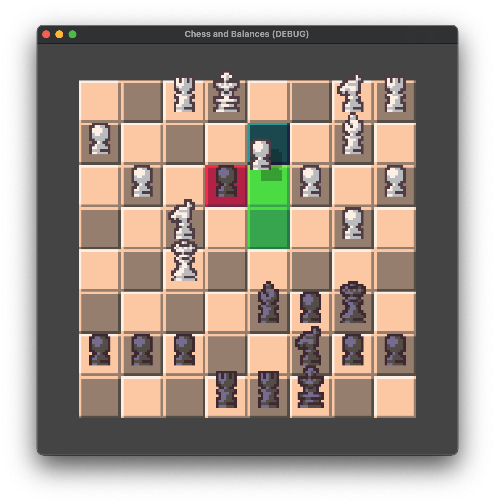
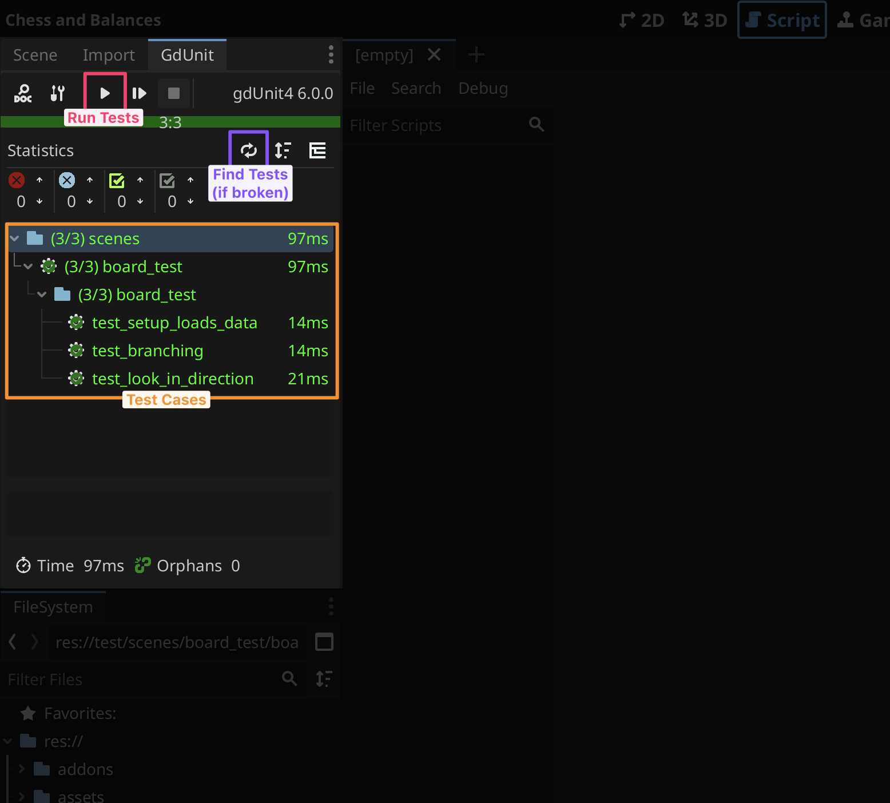

  <picture>
    
  </picture>

  <i>Chess and Balances</i>

---

## 🧪 Testing - For CS3203 Code Review

When checking our unit tests, they are each in their own branch as of 2025-10-31. Make sure you checkout the branch for the classmate you are reviewing. Each of us have linked to the proper test file in our own branch in the master document.

To check if unit tests are passing, go to the GdUnit tab in the top left of the Godot editor and click the Rerun Unit Tests button. You may have to click the Run Discover Tests button in the same panel before they appear.

---

Chess and Balances is an in-development game seeking to re-imagine the classic game of Chess

## 📥 Downloading and Playing

As we are very early in development, there are currently no released builds. To try the game out, see **🔧 Building / Contributing**

## 🔧 Building / Contributing

1. Install [Godot](https://godotengine.org/). The project is currently using version **4.4.x**, and does not require .NET
2. Make sure you have [Git](https://git-scm.com/downloads) installed
3. Clone the repository: `git clone https://github.com/Software-ENGR-team-A/Chess.git`
4. Open the project in Godot: *Import > `/path/to/chess-and-balances/project.godot` > Open*
5. You can begin playing with the Play button in the top right. To build the project instead, go to *Project > Export...* There are no presets defined yet, so configuring your export is up to you. See [Export — Godot Engine](https://docs.godotengine.org/en/stable/tutorials/export/index.html)

Code formatting is enforced with [godot-gdscript-toolkit](https://github.com/Scony/godot-gdscript-toolkit). Before requesting a change, run `gdformat .` and check that `gdlint .` is passing from the project directory. Pull requests failing to meet this cannot be merged until this is done.

## 🛡️ License

Chess and Balances is licensed under [GNU Lesser General Public License v3.0](https://www.gnu.org/licenses/lgpl-3.0.en.html) (or later) - see the [`LICENSE`](LICENSE) file for details.
