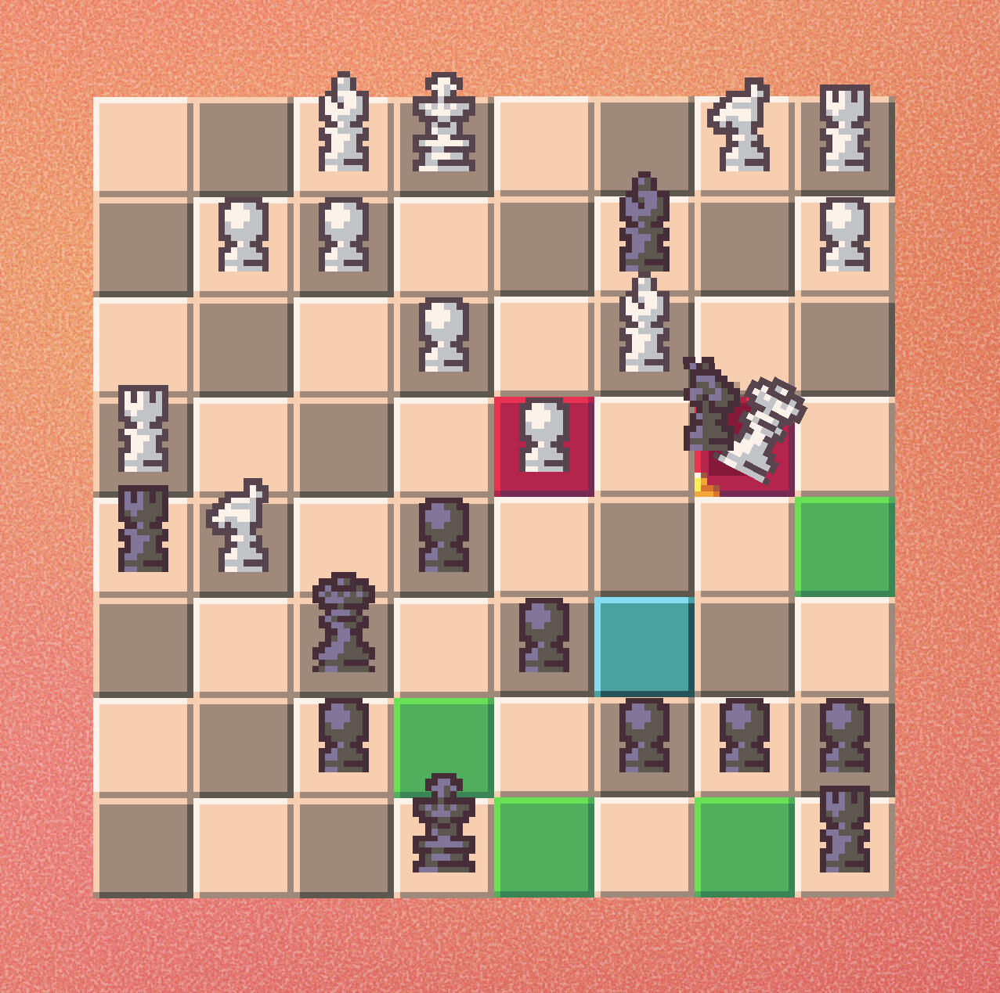

  <picture>
    
  </picture>

  <i>Chess and Balances</i>

---

Chess and Balances is an in-development game seeking to re-imagine the classic game of Chess

Currently, the only thing implemented is a functioning Chess system, with an underlying structure to enable highly customizable variants. We're imagining a less-serious experience, aimed towards beginner to intermediate Chess players. While we're still imagining the core gameplay loop, we're leaning towards a single-player, roguelike game that starts with limited pieces and lets you build up your army and upgrade your units on an evolving battlefield against an AI opponent.

A major source of gameplay inspiration we keep returning to is the 2024 indie hit *[Balatro](https://www.playbalatro.com/)*, whose core gameplay revolves around alternating shop and gameplay phases where you must build an increasingly more powerful poker deck to beat an exponentially increasing score target. Another inspiration is the nearly incomprehensible [5D Chess With Multiverse Time Travel](https://www.5dchesswithmultiversetimetravel.com/), a game that pushes Chess gameplay into absurd extremes as you try to prevent checkmates in the past, present, future, and across multiple timelines.

## 📥 Downloading and Playing

As we are very early in development, there are currently no released builds. To try the game out, see **🔧 Building / Contributing**

## 🔧 Building / Contributing

1. Install [Godot](https://godotengine.org/). The project is currently using version **4.5.x**, and does not require .NET
2. Make sure you have [Git](https://git-scm.com/downloads) installed
3. Clone the repository: `git clone https://github.com/Software-ENGR-team-A/Chess.git`
4. Open the project in Godot: *Import > `/path/to/chess-and-balances/project.godot` > Open*
5. You can begin playing with the Play button in the top right. To build the project instead, go to *Project > Export...* There are no presets defined yet, so configuring your export is up to you. See [Export — Godot Engine](https://docs.godotengine.org/en/stable/tutorials/export/index.html)

Code formatting is enforced with [godot-gdscript-toolkit](https://github.com/Scony/godot-gdscript-toolkit). Before requesting a change, run `gdformat .` and check that `gdlint .` is passing from the project directory. Pull requests failing to meet this will not be merged until this is addressed.

## 🛡️ License

Chess and Balances is licensed under [GNU Lesser General Public License v3.0](https://www.gnu.org/licenses/lgpl-3.0.en.html) (or later) - see the [`LICENSE`](LICENSE) file for details.
